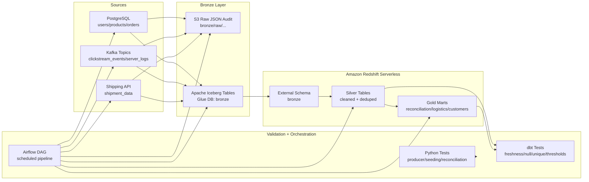

# Real-Time Reconciliation Lakehouse execution guide

This guide assumes Redshift Serverless, S3, and Glue are created, and the project is running from `E:\real-time-reconciliation-lakehouse`.

## 1. Environment setup

Real secrets belong in `.env`, not `.env.example`.

Required values:

```env
APP_ENV=local
DATABASE_URL=postgres://<user>:<password>@<host>:<port>/<database>?sslmode=require
KAFKA_BOOTSTRAP_SERVERS=127.0.0.1:9092
KAFKA_CLICKSTREAM_TOPIC=clickstream_events
KAFKA_SERVER_LOGS_TOPIC=server_logs
MOCK_SHIPPING_API_HOST=0.0.0.0
MOCK_SHIPPING_API_PORT=8000

AWS_REGION=us-east-1
AWS_S3_BUCKET_NAME=real-time-reconciliation-bronze
AWS_S3_PREFIX=bronze/raw
AWS_ACCESS_KEY_ID=<optional-local-key>
AWS_SECRET_ACCESS_KEY=<optional-local-secret>
AWS_SESSION_TOKEN=

REDSHIFT_HOST=<your-redshift-serverless-workgroup-endpoint>
REDSHIFT_PORT=5439
REDSHIFT_DATABASE=dev
REDSHIFT_USER=admin
REDSHIFT_PASSWORD=<your-redshift-password>
```

Expected check:

```powershell
venv\Scripts\python.exe scripts\preflight_check.py
```

Expected successful output:

```text
Preflight passed.
```

If it reports Redshift TCP unreachable, fix the workgroup networking:

- workgroup publicly accessible if connecting from laptop,
- security group inbound TCP 5439 from your public IP,
- laptop/network allows outbound TCP 5439.

## 2. Install dependencies

```powershell
venv\Scripts\activate
pip install -r requirements.txt
```

Expected output:

```text
Successfully installed ...
```

If `dbt.exe` is not created on Windows, use:

```powershell
venv\Scripts\python.exe -m dbt.cli.main --version
```

Expected output includes:

```text
Core: installed: 1.10.2
Plugins: redshift: 1.9.5
```

## 3. Start local infrastructure

```powershell
docker compose up -d
```

Expected output:

```text
Container rtrl-zookeeper Started
Container rtrl-kafka Started
```

## 4. Seed PostgreSQL source data

```powershell
python src/simulators/postgres_seeder.py
```

Expected output:

```text
Seeded users, products, and starter orders.
```

Optional dynamic order updates:

```powershell
python src/simulators/postgres_transaction_simulator.py
```

Expected output:

```text
[INSERT] order_id=...
[UPDATE] order_id=...
[PRICE UPDATE] product_id=...
```

## 5. Start shipping API

In a separate terminal:

```powershell
python src/simulators/shipping_api_mock.py
```

Expected output:

```text
Uvicorn running on http://0.0.0.0:8000
```

Validate:

```powershell
curl http://localhost:8000/health
```

Expected output:

```json
{"status":"ok","service":"shipping-api-mock"}
```

## 6. Produce Kafka events

In separate terminals:

```powershell
python src/producers/clickstream_producer.py --max-events 100 --interval 0.1
python src/producers/server_log_producer.py --max-events 100 --interval 0.1
```

Expected output:

```text
sent event id=... type=...
sent log line: ...
```

## 7. Bronze ingestion

For production-oriented Bronze ingestion into S3 raw audit files and Glue/Iceberg tables:

```powershell
python -m src.ingestion.bronze.runner --bucket real-time-reconciliation-bronze --max-messages 100 --postgres-limit 1000 --write-iceberg
```

Expected output:

```json
{
  "kafka_topics": 2,
  "postgres_tables": 3,
  "shipping_payloads": 1,
  "s3_paths": ["s3://..."],
  "iceberg_tables": [
    "glue_catalog.bronze.clickstream",
    "glue_catalog.bronze.server_logs",
    "glue_catalog.bronze.users",
    "glue_catalog.bronze.products",
    "glue_catalog.bronze.order_changes",
    "glue_catalog.bronze.shipment_data"
  ]
}
```

For continuous Kafka streaming into Iceberg:

```powershell
python src/ingestion/bronze/spark_ingest.py
```

Expected output:

```text
Bronze streaming queries started: 4
```

## 8. Bootstrap Redshift

Run this in Redshift Query Editor v2 against database `dev`:

```sql
-- sql/redshift_bootstrap.sql
CREATE EXTERNAL SCHEMA IF NOT EXISTS bronze
FROM DATA CATALOG
DATABASE 'bronze'
IAM_ROLE default
REGION 'us-east-1';

CREATE SCHEMA IF NOT EXISTS silver;
CREATE SCHEMA IF NOT EXISTS gold;
```

Validate:

```sql
SELECT schemaname, tablename
FROM svv_external_tables
WHERE schemaname = 'bronze'
ORDER BY tablename;
```

Expected tables:

```text
clickstream
order_changes
products
server_logs
shipment_data
users
```

## 9. Run Silver and Gold dbt layers

```powershell
venv\Scripts\python.exe -m dbt.cli.main debug --profiles-dir .
venv\Scripts\python.exe -m dbt.cli.main source freshness --profiles-dir .
venv\Scripts\python.exe -m dbt.cli.main run --profiles-dir . --select silver
venv\Scripts\python.exe -m dbt.cli.main test --profiles-dir . --select silver
venv\Scripts\python.exe -m dbt.cli.main run --profiles-dir . --select gold
venv\Scripts\python.exe -m dbt.cli.main test --profiles-dir . --select gold
```

Expected dbt output:

```text
Completed successfully
PASS=...
```

Created Redshift tables:

```text
silver.silver_users
silver.silver_products
silver.silver_orders
silver.silver_clickstream
silver.silver_server_logs
silver.silver_shipping_status
gold.gold_order_reconciliation
gold.gold_logistics_performance
gold.gold_customer_summary
```

## 10. Business validation queries

```sql
SELECT reconciliation_status, COUNT(*)
FROM gold.gold_order_reconciliation
GROUP BY 1
ORDER BY 2 DESC;
```

Expected output: counts for statuses such as `matched`, `missing_purchase_event`, `payment_not_settled`, and `purchase_without_order`.

```sql
SELECT logistics_status, COUNT(*)
FROM gold.gold_logistics_performance
GROUP BY 1
ORDER BY 2 DESC;
```

Expected output: counts for `delivered`, `in_progress`, `missing_shipment`, `carrier_delay`, or `sla_breach`.

```sql
SELECT customer_segment, activity_status, COUNT(*)
FROM gold.gold_customer_summary
GROUP BY 1, 2
ORDER BY 3 DESC;
```

Expected output: customer segmentation and activity distribution.

## Full project workflow

1. Local simulators generate source data in PostgreSQL, Kafka, and the shipping API.
2. Bronze ingestion stores raw audit files in S3 and appends queryable Iceberg tables registered in Glue.
3. Redshift Serverless exposes Glue/Iceberg Bronze data through an external schema named `bronze`.
4. dbt builds Silver Redshift tables with typed, deduplicated, standardized records.
5. dbt builds Gold marts for reconciliation, logistics performance, and customer analytics.
6. dbt tests and Python tests validate freshness, uniqueness, nulls, accepted values, thresholds, and local logic.
7. Airflow orchestrates the reproducible sequence in `orchestration/airflow/dags/reconciliation_lakehouse_dag.py`.

## Architecture diagram


